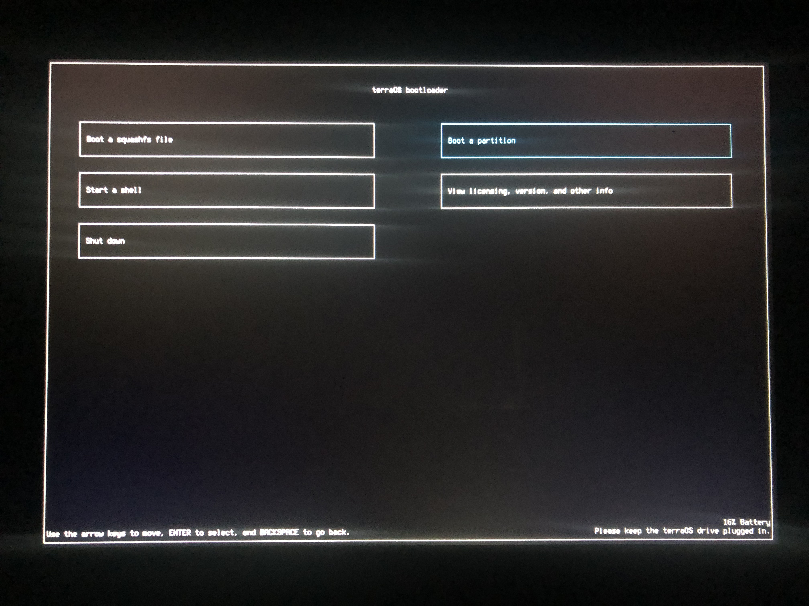

# stratOS
A (much blue) fork, and even more realistically, a somewhat subtle modification of terraOS that still lets you boot Linux-based operating systems from a RMA shim while still being functional and a little bit more nicer to have around, since just why not.
Hats off to r58Playz for the original, though.



## How does it work?
### stratOS
stratOS is no different from terraOS, atleast, very barely, it changes a bit of the source and some scripts to better suit and properly compile or work altogether. It works by going through the entire process almost identical to the origianl terraOS, but with the modified buildroot and this repo that I've forked, from there, the binary of the terraOS will change, and even furthermore compiled from source and unstripped when creating the bootloader image. This allows stratOS's modifications to take place and ultimately, take charge of the booting whilst not replacing terraOS as a whole.

### terraOS
terraOS utilizes a bug in chromebook RMA shims, which are bootable recovery images that are used for running diagnostic utilities, to chainload regular Linux distros by replacing the rootfs. Replacing the rootfs entirely doesn't work however, since the RMA shim boots in an environment made specifically for those diagnostic utilities. terraOS is made to get around that. 

## How do I add my own distros?
It's the same as you would in terraOS, check [here](https://github.com/r58Playz/terraos?tab=readme-ov-file#how-do-i-add-my-own-distros).

## How do I use it?
For starters, please make sure you're using an Arch Linux system, as r58Playz originally made scripts solely for Arch Linux and they most likely lack scripts to bootstrap Arch Linux in.
<shim.bin> = Your shim.bin, which you download from [https://chrome100.dev/](https://chrome100.dev/).
**
=> You should see this named something like `octopus.bin` based on your chromebook's board.**

<bootloader.img> = The bootloader image you've made, depending on whether you've changed the filename or not.
**
=> Run `file` on this and see if the output is: `bootloader.img: DOS/MBR boot sector; partition 1 : ID=0xee, start-CHS (0x0,0,2), end-CHS (0x3ff,255,63), startsector 1, 262143 sectors, extended partition table (last)` or similar**

<reven_recovery.bin> = The recovery image of the `reven` board, find it here: [https://chrome100.dev/board/reven](https://chrome100.dev/board/reven).
**
=> It may look like: `chromeos_16033.58.0_reven_recovery_stable-channel_mp-v6.bin`**

<board_recovery.bin> = The recovery image of **your chromebook's** board. Find in [https://chrome100.dev/](https://chrome100.dev/).
**
=> This could look like `chromeos_16033.58.0_octopus_recovery_stable-channel_mp-v35.bin`, depending on your chromebook's board. **

[] = You can modify this as you like, although it's recommended to keep it the same (but keep the extension or not if there is or isn't one, preferably).
### 1. Arch Linux Only
1. Clone this repo with `git clone https://github.com/gh-doot/stratOS`.
2. chdir and create a build directory, or just `mkdir build` in it.
3. Run `bash ../scripts/build_stage1.sh <defconfig>`
    1. Use `terraos` as the defconfig if building for x86_64 chromebooks.
    2. Use `terraos_jacuzzi` as the defconfig if building for `jacuzzi` board chromebooks. (Support for `jacuzzi` board chromebooks is experimental and may not work, however.)
4. Run `bash ../scripts/build_aur_packages.sh`.
5. Run the following as below with the correct parameters:
```
    bash ../scripts/build_rootfs.sh [arch_rootfs] <shim.bin> <board_recovery.bin>
    bash ../scripts/build_bootloader.sh <shim.bin> [bootloader.img]
    bash ../scripts/build_arch_only.sh [arch_rootfs]
```
This will place a built bootloader image, a bootloader image with the arch rootfs, and one of each zst and zip of the arch rootfs.
### 2. ChromeOS Only
1. Do everything from **Arch Linux Only** from Step 1-3.
2. Run `bash ../scripts/build_bootloader.sh <shim.bin> [bootloader.img]`
3. Run `bash ../scripts/build_cros_persistent.sh <reven_recovery.bin> <board_recovery.bin> <shim.bin> <bootloader.img> [terra_chromeos.img]`
This will place a built bootloader image, and a bootloader with the terraOS ChromeOS in the build directory.
### 3. All of them
1. Do everything from **Arch Linux Only** from Step 1-**4**.
2. Run `bash ../scripts/build_all.sh <shim.bin> <board_recovery.bin> <reven_recovery.bin>`.
3. This may take some time, so just wait.
This will place a built bootloader image, squashfs and tarballs of the arch rootfs, a bootloader image with the arch rootfs, a bootloader image with terraOS chromeOS, and a bootloader image with both the arch rootfs and terraOS chromeOS in the build directory.

The default arch rootfs user is `stratos` and its password is `stratos`.

## How do I install to internal storage?
The exact same way you would for terraOS, as follows;
1. Boot into stratOS and copy over the image you used to flash your terraOS drive.
2. Use GParted or `sudo fdisk -l` to find your internal storage. Replace `/dev/mmcblkX` in the rest of the steps with the internal storage device.
3. Run `sudo dd if=<image> of=/dev/mmcblkX status=progress bs=16M oflag=direct` to write the image to the internal storage. Replace `<image>` with the path to the image you copied.

Alternatively you can manually create a `chromeOS rootfs` type partition via `parted` or `fdisk`, format as ext4, and copy over the rootfs.

## Can I use a different distro?
Yes, however you will need to either use a non-systemd distro or manually compile systemd with the [chromiumos patches](https://aur.archlinux.org/cgit/aur.git/tree/0002-Disable-mount_nofollow-for-ChromiumOS-kernels.patch?h=systemd-chromiumos).
